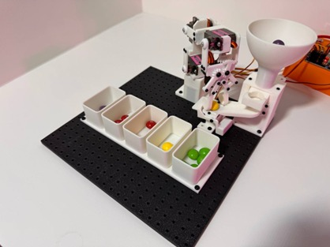

# 5-DoF Robotic Arm for Color-Based Sorting

This repository contains the documentation and my contributions to a collaborative group project for the "CT7158: Robotic Systems" module at London Metropolitan University. The project involved the complete design, 3D printing, assembly, and programming of a 5-degree-of-freedom robotic arm capable of sorting Skittles by color.

My primary contributions to this project included the **firmware development for the ESP32**, the **custom gripper design**, **servo motor testing**, and the **project documentation**.

▶️ **[Watch the Demonstration on YouTube](https://youtu.be/oouUzXQNhF4?si=kfHoVpSnmO_adTAg)**

📄 **[View the Full Project Report (PDF)](./Robotics_CSWK.pdf)** for a comprehensive overview of the project, including contributions from all team members.

## ✨ Key Features

* **5-DoF Articulation:** A custom-designed and 3D-printed robotic arm with five axes of movement for high maneuverability.
* **Automated Color Sorting:** Integrates a TCS34725 color sensor to detect the color of a Skittle and an automated system to sort it into the correct container.
* **Inverse & Forward Kinematics:** The firmware includes a custom implementation of the Cyclic Coordinate Descent (CCD) algorithm to calculate the required joint angles to reach a specific XYZ coordinate.
* **Web-Based Control & Visualization:** A real-time 3D visualization of the robotic arm, built with p5.js and hosted on an ESP32 web server, allows for remote monitoring and control.
* **G-Code Command Interface:** The arm can be controlled via G-Code commands sent through the web interface for precise, repeatable movements.

## 🚀 Core Competencies

* **Embedded Systems:** C++ programming for the ESP32 microcontroller using the Arduino IDE.
* **Robotics & Kinematics:** Implementation of Inverse Kinematics (IK) and Forward Kinematics (FK) for robotic manipulators.
* **Sensor & Actuator Integration:** Interfacing with servo motors (via PCA9685 driver), and I2C sensors (TCS34725).
* **Web Development & IoT:** Hosting a web server on an ESP32, serving HTML/JavaScript files from an SD card, and creating a real-time 3D visualization with p5.js (WebGL).
* **3D Design & Printing:** Designing and optimizing custom parts for the robotic arm and its peripherals using Autodesk Fusion 360.

## ⚙️ Hardware & Software

* **Microcontroller:** ESP32 Devkit V1
* **Actuators:** 6x MG90S Servo Motors
* **Servo Driver:** PCA9685 16-Channel PWM Driver
* **Sensor:** TCS34725 Color Sensor
* **Firmware:** C++ (Arduino IDE)
* **Web Interface:** HTML, JavaScript, p5.js
* **3D Design:** Autodesk Fusion 360

## 📁 Repository Structure

* `/Firmware`: Contains the Arduino `.ino` sketch for the ESP32 microcontroller.
* `/Hardware_Design`: Includes the `.stl` files for 3D printing and the source `.f3d` CAD files.
* `/Web_Interface`: Contains the `index.html` and `sketch.js` files for the visualization and control panel.
* `Robotics_CSWK.pdf`: The detailed project report.
